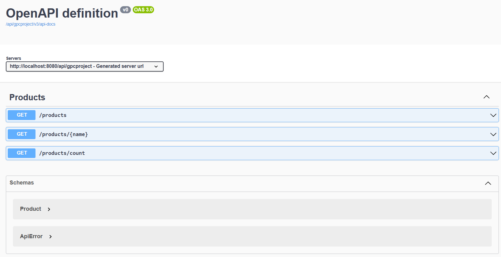

# GPC Project

## Description
GPC Project is a Spring Boot application designed to provide API endpoints for accessing product information.

## Requirements
For building and running the application you need:
- Java Development Kit (JDK) 17
- Maven 3

## Running the application locally
There are several ways to run a Spring Boot application on your local machine. One way is to execute the main method in the pl.holowinska.gpcproject.GpcprojectApplication class from your IDE.
Alternatively you can use the Spring Boot Maven plugin like so:
1. Navigate to the project directory.
2. Use Maven to run the Spring Boot application:
    ``` sh
    ./mvnw spring-boot:run
    ```

## API Documentation
For detailed API documentation, please refer to the Swagger UI. After starting the application, the Swagger UI can be accessed at:
[http://localhost:8080/api/gpcproject/swagger-ui/index.html](http://localhost:8080/api/gpcproject/swagger-ui/index.html)



## Testing
To run the tests, use:
```sh
    ./mvnw test
```

